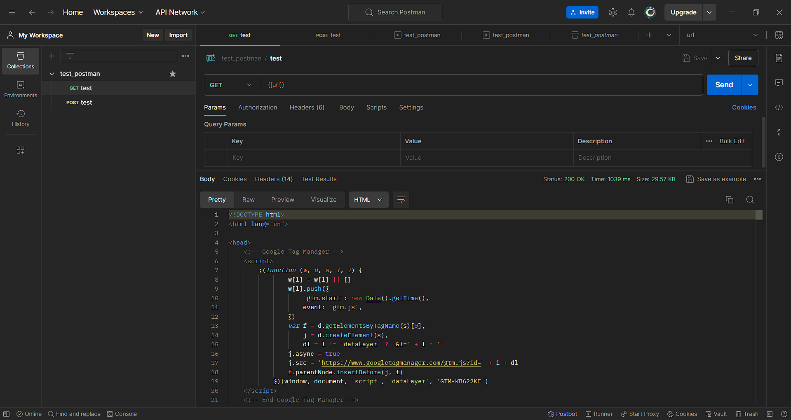
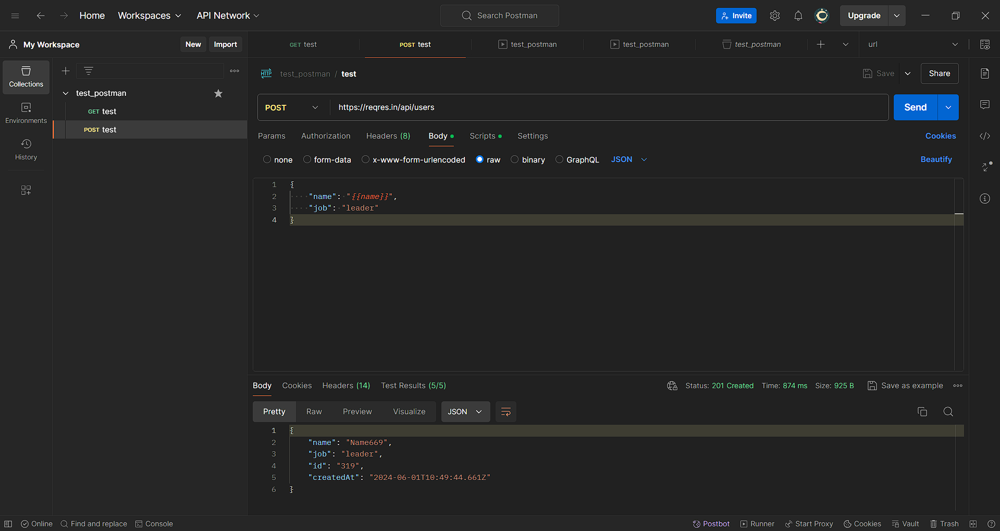
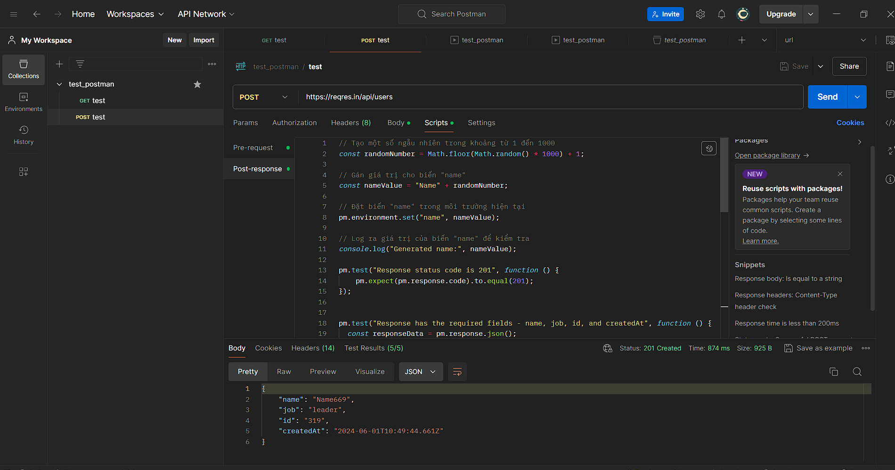
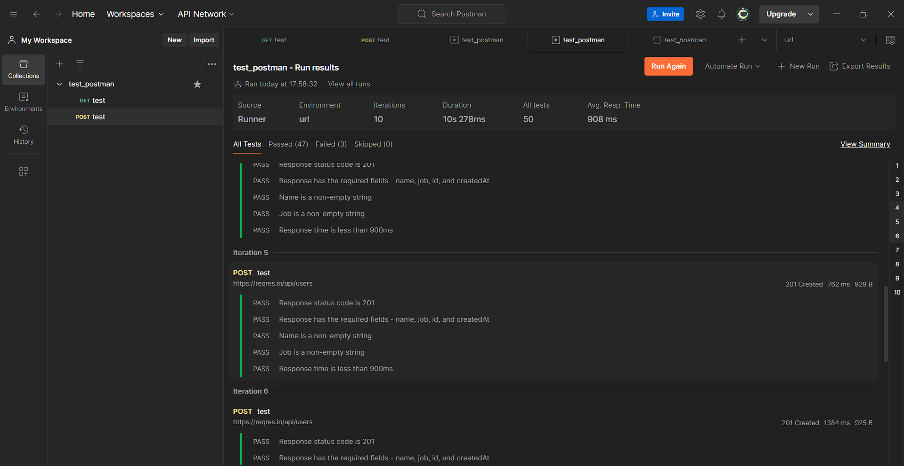

# Postman API Testing

This repository contains examples of how to test APIs using Postman. Below are the detailed steps and screenshots to guide you through the process.

## Table of Contents
1. [Introduction](#introduction)
2. [GET Request Example](#get-request-example)
3. [POST Request Example](#post-request-example)
4. [Using Scripts in Postman](#using-scripts-in-postman)
5. [Running Tests in Postman](#running-tests-in-postman)

## Introduction
Postman is a popular tool for testing APIs. It allows you to send requests, examine responses, and automate testing with scripts. This guide provides examples of how to use Postman for GET and POST requests, including using scripts to automate tests.

## GET Request Example
The following example demonstrates how to send a GET request using Postman.

In this example:
- A GET request is sent to a specified URL.
- The response is displayed in the "Pretty" view.
- The status code, response time, and size are shown.

## POST Request Example
The following example demonstrates how to send a POST request using Postman.

In this example:
- A POST request is sent to `https://reqres.in/api/users`.
- The request body contains JSON data with the fields `name` and `job`.
- The response is displayed in the "Pretty" view with the response status and data.

## Using Scripts in Postman
You can use scripts in Postman to automate tasks and validate responses. Below is an example of a script used to generate random data and verify response fields.

In this example:
- A random number is generated and assigned to the `name` field.
- Environment variables are used to store and retrieve values.
- Tests are written to validate the response status and fields.

## Running Tests in Postman
Postman allows you to run multiple tests and view the results in a summary. Below is an example of running tests in Postman.

In this example:
- Multiple iterations of the POST request are run.
- Each iteration is validated against the expected response.
- Results are summarized with the status of each test.

## Conclusion
Postman is a powerful tool for API testing, offering features such as request building, scripting, and automated testing. This guide covered basic examples of GET and POST requests, using scripts, and running tests in Postman. 

For more detailed documentation and advanced features, refer to the official [Postman documentation](https://learning.postman.com/docs/getting-started/introduction/).
